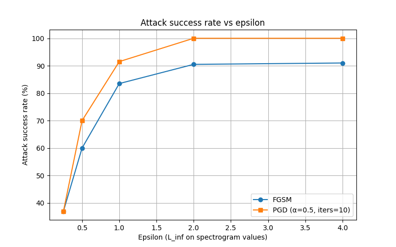

# Inaudible Evasion: A White-Box Adversarial Audio Simulator for Audio Classification

## Overview

Inaudible Evasion is a published research project that evaluates the robustness of CNN-based environmental sound classifiers against FGSM-generated white-box adversarial attacks using the UrbanSound8K dataset.

The project implements gradient-based adversarial attack techniques to generate imperceptible perturbations that cause audio classification models to misclassify environmental sounds while maintaining perceptual similarity to the original audio. Through extensive experimentation, the framework demonstrates how deep learning systems can be vulnerable to carefully crafted adversarial examples, highlighting important security concerns in real-world AI applications.

---

## Research Publication

📄 **Published Paper**

**Inaudible Evasion: A White-Box Adversarial Audio Simulator for Audio Classification**

Published in *JETIR (Journal of Emerging Technologies and Innovative Research), Volume 12, Issue 11, November 2025.*

Paper Link: **https://www.jetir.org/papers/JETIR2511538.pdf**

---

## Features

* Environmental sound classification using deep learning
* White-box adversarial attack simulation
* Fast Gradient Sign Method (FGSM) implementation
* Mel-spectrogram-based audio representation
* Model robustness evaluation
* Attack visualization and analysis
* Reproducible research workflow

---

## Project Structure

```text
.
├── src/
│   ├── attack_demo.py
│   ├── attack_sweep_fixed.py
│   ├── cnn_model.py
│   ├── evaluate.py
│   ├── inaudible_attacks.py
│   ├── model.py
│   ├── preprocess_audio.py
│   ├── train.py
│   ├── train_adv.py
│   ├── utils.py
│   └── verify_mels.py
│
├── notebooks/
├── README.md
├── requirements.txt
└── attack_success_vs_eps.png
```

---

## Dataset

This project uses the **UrbanSound8K** dataset.

Download the dataset from:

https://urbansounddataset.weebly.com/urbansound8k.html

Place the extracted dataset inside:

```text
data/UrbanSound8K/
```

The dataset is excluded from this repository because of GitHub storage limitations.

---

## Installation

Clone the repository:

```bash
git clone https://github.com/Rumaisa-786/A-White-Box-Adversarial-Audio-Simulator-For-Audio-Classification.git

cd A-White-Box-Adversarial-Audio-Simulator-For-Audio-Classification
```

Create a virtual environment:

```bash
python -m venv venv
```

Activate it:

Windows:

```bash
venv\Scripts\activate
```

Install dependencies:

```bash
pip install -r requirements.txt
```

---

## Usage

### Train the Classifier

```bash
python src/train.py
```

### Evaluate Model Performance

```bash
python src/evaluate.py
```

### Generate Adversarial Examples

```bash
python src/attack_demo.py
```

### Perform Attack Sensitivity Analysis

```bash
python src/attack_sweep_fixed.py
```

---

## Methodology

1. Audio preprocessing and normalization
2. Mel-spectrogram feature extraction
3. CNN-based environmental sound classification
4. FGSM adversarial perturbation generation
5. Robustness evaluation under attack conditions
6. Performance degradation analysis

---

## Results

The experiments demonstrate that even small adversarial perturbations can significantly reduce classification accuracy while remaining nearly imperceptible to human listeners.

Example attack-success visualization:



---

## Technologies Used

* Python
* PyTorch
* NumPy
* Librosa
* Matplotlib
* Scikit-learn
* Jupyter Notebook

---

## Key Contributions

* Designed a white-box adversarial attack framework for audio classification.
* Evaluated the robustness of CNN-based sound classifiers.
* Demonstrated the effectiveness of FGSM attacks on environmental sound recognition.
* Contributed to research in adversarial machine learning and AI security.

---

### Citation

```bibtex
@article{syed2025inaudible,
  title={Inaudible Evasion: A White-Box Adversarial Audio Simulator for Audio Classification},
  author={Syed, Rumaisa},
  journal={JETIR},
  volume={12},
  number={11},
  year={2025},
  month={November},
  url={https://www.jetir.org/papers/JETIR2511538.pdf}
}
```

---

## Author

**Rumaisa Syed**

Applied Machine Learning | Adversarial AI | Cybersecurity

GitHub: https://github.com/Rumaisa-786

---

## License

This project is released for academic and research purposes.
